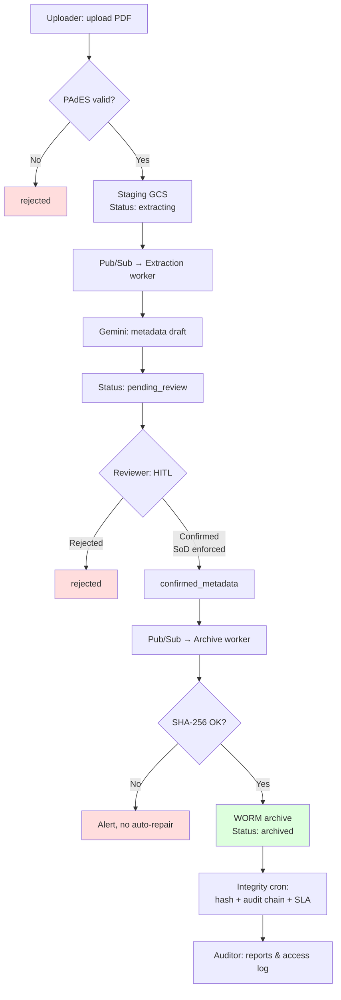

# Contract Management Tool

Compliance-focused archive for signed **NDAs** and **AVVs** (data processing agreements) on Google Cloud (region `europe-west3`). Human access only via **IAP + HTTPS load balancer**; workers run internally (`INTERNAL_ONLY`).

## Architecture

| Component | Purpose |
|---|---|
| `services/api` | REST API, web UI (review, audit), IAP auth |
| `services/extraction-worker` | AI metadata extraction (Gemini) via Pub/Sub |
| `services/archive-worker` | Archival to WORM bucket via Pub/Sub |
| `services/integrity-cron` | Periodic integrity and audit-chain checks |
| `libs/common` | Shared domain logic (audit, GCS, PAdES, contracts) |
| `terraform/` | GCP infrastructure (modular) |
| `schemas/` | JSON schemas for NDA/AVV extraction |

## Workflow

### Steps

1. **Upload** — Uploader submits a signed PDF (NDA/AVV). PAdES signature is validated; invalid signatures are rejected (`rejected`).
2. **Staging** — Valid PDFs go to the staging bucket; status `extracting`. Pub/Sub triggers the extraction worker.
3. **Extraction** — Gemini extracts metadata as a **draft** (`extraction_draft`). Status moves to `pending_review`. AI output is never the sole source of truth.
4. **Review (HITL)** — Reviewer inspects the draft, confirms or rejects. **SoD:** `uploaded_by ≠ confirmed_by`. Confirmed metadata (`confirmed_metadata`) is the authoritative record.
5. **Archival** — After confirmation, the archive worker copies the PDF to the WORM bucket (SHA-256 check), sets retention, and deletes staging. Status `archived`.
6. **Integrity check** — Scheduler/cron verifies archive hashes, audit chain, and review SLA; deviations trigger alerts (no auto-repair).
7. **Audit** — Hash-chained `audit_events` and `access_events`; auditor role for reports and legal holds.

### Workflow diagram



## Roles

| Role | Permission |
|---|---|
| **uploader** | Upload contracts |
| **reviewer** | Review queue, confirm/reject |
| **auditor** | Audit reports, legal holds |
| **admin** | All roles |

## Local development

```bash
go run ./services/api/cmd/server
```

Without GCP environment variables, the API uses local SQLite (`.local-data/`) and local GCS (`.local-gcs/`). Run workers separately:

```bash
go run ./services/extraction-worker/cmd/worker
go run ./services/archive-worker/cmd/worker
go run ./services/integrity-cron/cmd/worker
```

## Compliance principles

- No public Cloud Run access, no user-facing GCS signed URLs
- PAdES validation fails closed; result stored in audit trail
- Archive only after human confirmation; hash mismatch → alert, no overwrite
- Minimal PII in DB/BigQuery — contract text only in GCS
